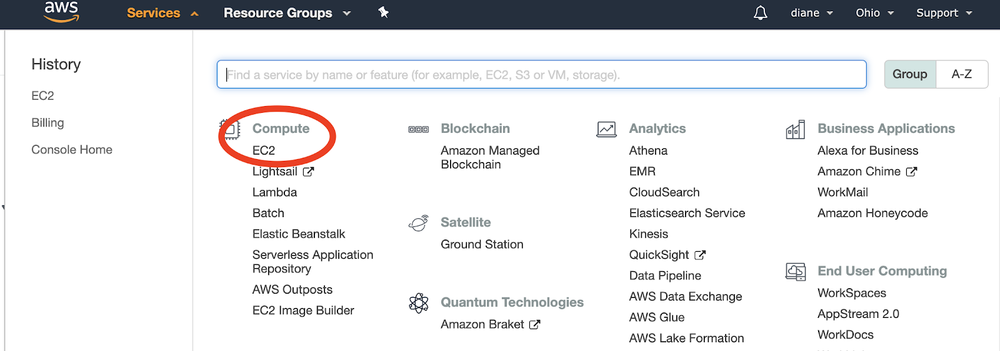
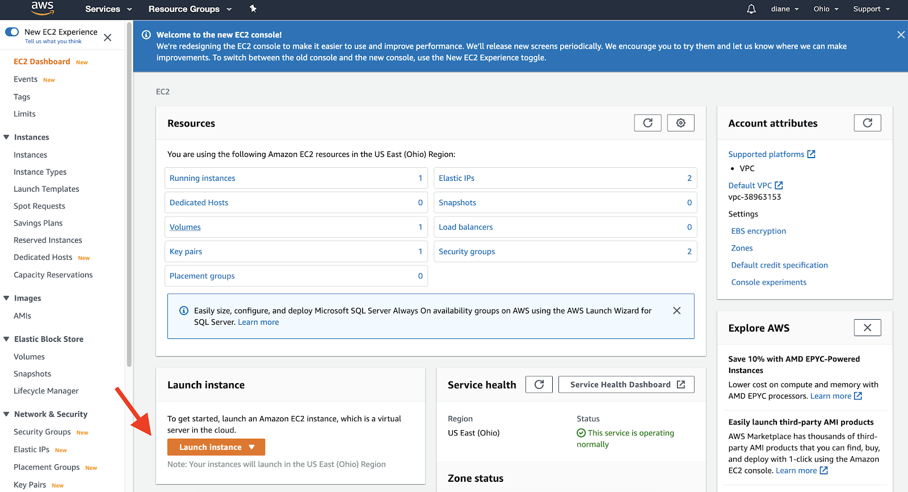
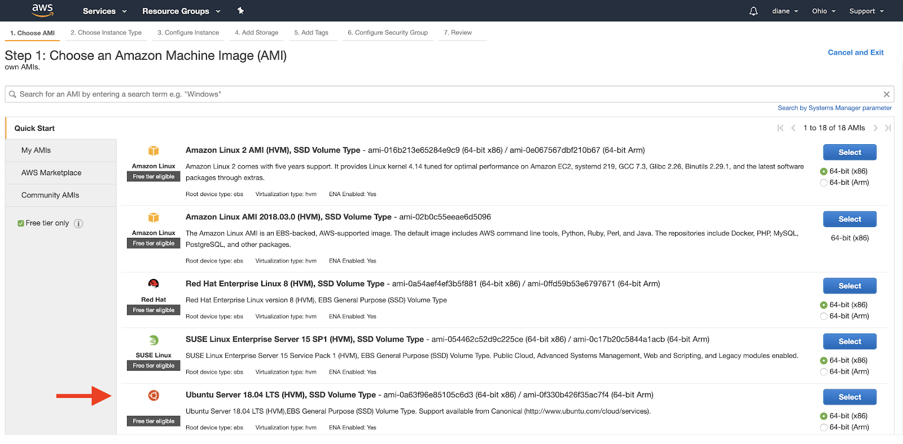
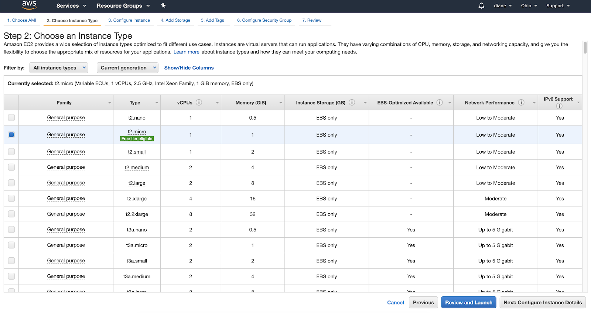
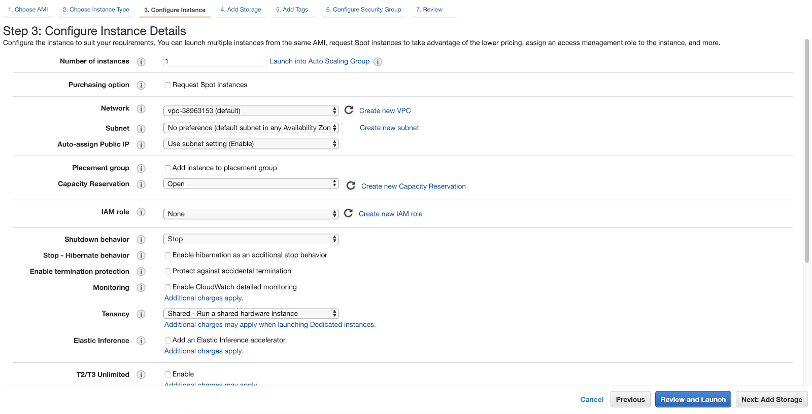
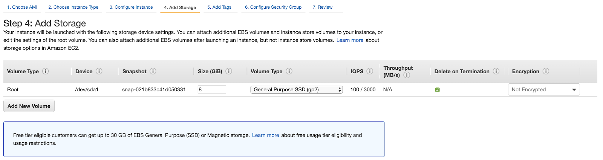
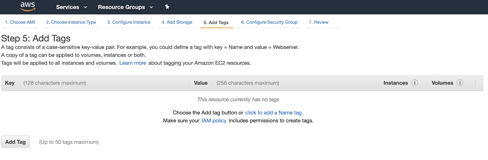
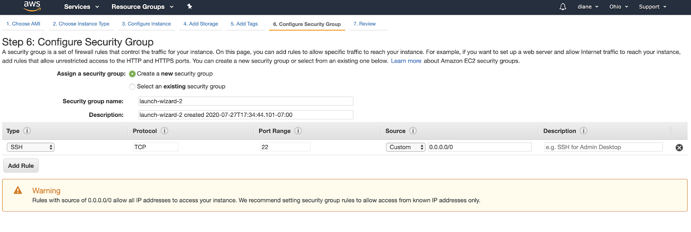
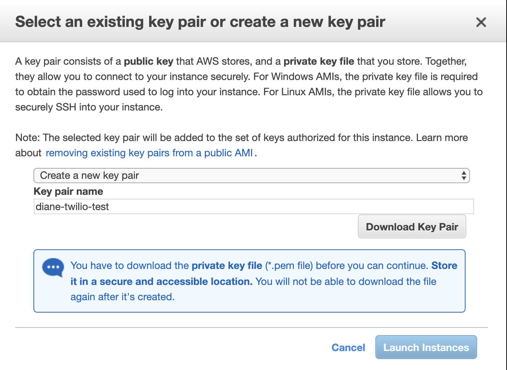
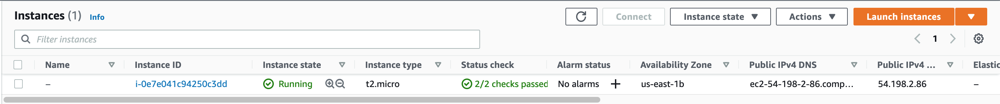

## Welcome to GitHub Pages

You can use the [editor on GitHub](https://github.com/depplenny/lightcone/edit/gh-pages/index.md) to maintain and preview the content for your website in Markdown files.

Whenever you commit to this repository, GitHub Pages will run [Jekyll](https://jekyllrb.com/) to rebuild the pages in your site, from the content in your Markdown files.

Keep gh-pages up to date with a master branch:

```
$ git add .
$ git status // to see what changes are going to be commited
$ git commit -m 'Some descriptive commit message'
$ git push origin master
```

```
$ git clone https://github.com/depplenny/lightcone
$ cd lightcoen/
$ git checkout gh-pages // go to the gh-pages branch
$ git rebase main // bring gh-pages up to date with master
$ git push origin gh-pages // commit the changes
$ git checkout master // return to the master branch
```

======================================================================

# Deploy a Flask APP on AWS EC2 with Gunicorn and Nginx


## Contents

- Develope and test your flask app locally
- Create a AWS EC2 
- SSH into the virtual machine (EC2)
- Install softwares
- Transfer your project files to remote host (EC2)
- Install python packages
- Running a Flask app on a Gunicorn server
- Configuring Nginx to Proxy Requests
- Install SSL Certificate NGINX Server Steps (TODO)

## Develope and test your flask app locally
$ python3 main.py

## Create an AWS EC2

**Create an AWS user account**

In order to deploy fast and easily, create an AWS account. Upon logging back into your account, you have the option to login as a Root user or an IAM user.

I would recommend logging in as a Root user account to perform tasks requiring unrestricted access or creating an IAM user account that holds all of the permissions that a Root user would have. IAM users have the ability to work on the AWS dashboard with secure control access that can be modified.  

For the purpose of this article, I am logging in as a Root user to accomplish the necessary tasks.

**Navigate the EC2 Dashboard**

Click on the Services tab at the top of the webpage. Click on “EC2” under the Compute tab or type the name into the search bar to access the EC2 dashboard.



EC2 is a virtual server in the cloud where the Flask web app will live.


**Launch an Amazon EC2 instance**


Look for the Launch Instance section of the web page. It should be an orange button labeled Launch Instance as shown below. You can see that the section says “Note: Your instances will launch in the US East (Ohio) Region”. This may vary for your EC2 dashboard, as you want to make sure that your instances are within the US states if you are a developer in the US.



**Choose an AMI**

Select the Free Tier Only option on the left hand side under Quick Start. There is a list of Amazon Machine Images (AMI) that you can choose from, but we will select the Ubuntu Server with the Free tier eligible option.



You can choose the most updated version of Ubuntu.

**Choose the Instance Type**

Select the Instance with the Free tier eligible option. After checking the instance you want to use, click on Next: Configure Instance Details.



**Configure Instance Details**

View the default settings and move on to Next: Add Storage.



**Add storage**

Select the amount of storage necessary to run your application. Free tier eligible customers can get up to 30 GB. The storage used will depend on your application. For example, if your application requires image file storage, heavy graphic rendering, or storing user data it will use more storage. In this case, you will have to be careful and make sure your app does not go over the free GB allocation. If you go over your limit for the month, you will be charged.

After you select the size you want, click Next: Add Tags.




**Add Tags**

Tags are used to categorize your AWS resources for different use cases to easily keep track of your resources. This would apply if you are working on large scale projects and need to organize the AWS billing costs in a preferred structure. Thus, it might not be necessary to add tags to your machine especially if you only plan on using AWS one time for this specific application. Go ahead and click Next: Configure Security Group.




**Security Group**

Configuring the security is the last step before launching the AWS EC2 instance. If this is your first time creating a security group, select SSH in the dropdown under Type. Everything else in this section should be set to default to TCP at Port 22. Since we want people around the world to access the site, set the Source to these protocols to “0.0.0.0/0”.



Here’s the list of security types and protocols you should use. You can add additional rules to the following list as well:

Set Type HTTP, Protocol TCP, Port range 80, and Source to “0.0.0.0/0”.

Set Type Custom TCP, Protocol TCP, Port range 8080, and Source to “0.0.0.0/0”.

Set Type SSH, Protocol TCP, Port range 22, and Source to “0.0.0.0/0”.

Set Type HTTPS, Protocol TCP, Port range 443, and Source to “0.0.0.0/0”.


**Launch and create a key pair**

Click "Review and Launch" to confirm your security group for your project. After you review your settings and click "Launch" you will be prompted to select an existing key pair or create a new key pair.

Click on the drop down menu and select Create a new key pair. This is essential to access your AWS instance securely through your machine. Give your key pair a memorable name. For the purposes of this article, the key pair name is "lightcone".

Click on Download Key Pair after creating your key pair. This will download the private key file. Drag the .pem file to a secure location. It is absolutely crucial that you keep this .pem file safely, as this is the ONLY way to access your web application.



**Review and launch the instance**

Give your AWS dashboard some time to launch the instance. Your IPv4 Public IP is the address you need to access your web application. In this article, the public IP address for the instance is “54.198.2.86”.

The instance has been launched once the Instance State tab says running along with a green circle.



Reference: https://www.twilio.com/blog/deploy-flask-python-app-aws 

## SSH into the virtual machine

$ ssh -i lightcone.pem ubuntu@54.198.2.86

## Install softwares

$ sudo apt-get update

$ sudo apt-get install nginx

$ sudo apt-get install python3-pip python3-dev


## Transfer your project files to remote host

Run following command from a local shell.

Push:

$ rsync -avL --progress -e "ssh -i ~/Documents/lightcone/lightcone.pem" ~/Documents/lightcone/ ubuntu@54.198.2.86:/home/ubuntu/lightcone/

Pull:

$ rsync -chavzP -e "ssh -i ~/Documents/lightcone/lightcone.pem" ubuntu@54.198.2.86:/home/ubuntu/lightcone/ ~/Documents/lightcone/

## Install python packages

$ python3 -m pip install -r requirements.txt

$ export PATH=$PATH:/home/ubuntu/.local/bin
(modify ~/.profile if you want)


## Running a Flask app on a Gunicorn server

$ gunicorn --bind 0.0.0.0:8080 main:app

The above command binds http://0.0.0.0:8080 to your flask app

Go to your browser again, you should see Hello World!

http://54.198.2.86:8080/

Ctrl+c to stop Gunicorn server.

Next, let’s create the systemd service unit file. 
Creating a systemd unit file will allow Ubuntu’s init system to automatically start Gunicorn and serve the Flask application whenever the server boots.

$ sudo vim /etc/systemd/system/lightcone.service

```
[Unit]
Description=Gunicorn
After=network.target


[Service]
User=ubuntu
Group=www-data
WorkingDirectory=/home/ubuntu/lightcone
ExecStart=/home/ubuntu/.local/bin/gunicorn --workers 3 --bind unix:lightcone.sock -m 007 main:app


[Install]
WantedBy=multi-user.target

```

We can now start the Gunicorn service we created and enable it so that it starts at boot:

$ sudo systemctl start lightcone

$ sudo systemctl enable lightcone

$ sudo systemctl status lightcone


You now have a socket file, lightcone.sock, in the project directory.

And your flask app binds to lightcone.sock.

Whenever you modify /etc/systemd/system/lightcone.service, remember to reload it

$ sudo systemctl daemon-reload

Whenever you modify your project, remember to restart the Gunicorn service.

$ sudo systemctl restart lightcone


## Configuring Nginx to Proxy Requests

Our Gunicorn application server should now be up and running, waiting for requests on the socket file in the project directory. Let’s now configure Nginx to pass web requests to that socket by making some small additions to its configuration file.


$ sudo vim /etc/nginx/sites-available/lightcone


```
server {
    listen 80;
    server_name lightcone.ai 54.198.2.86;

    location / {
        include proxy_params;
        proxy_pass http://unix:/home/ubuntu/lightcone/lightcone.sock;
    }
}
```

To enable the Nginx server block configuration you’ve just created, link the file to the sites-enabled directory:


$ sudo ln -s /etc/nginx/sites-available/lightcone /etc/nginx/sites-enabled


With the file in that directory, you can test for syntax errors:

$ sudo nginx -t

If this returns without indicating any issues, restart the Nginx process to read the new configuration:

$ sudo systemctl restart nginx

($ sudo systemctl stop nginx)

Go to your browser again, you should see Hello World!

http://54.198.2.86:80/

Port 80 is the default for http, which can be ommited.

http://54.198.2.86/

If you encounter any errors, trying checking the following:

checks the Nginx error logs

$ sudo less /var/log/nginx/error.log

checks the Nginx access logs

$ sudo less /var/log/nginx/access.log

checks the Nginx process logs

$ sudo journalctl -u nginx

checks your Flask app’s Gunicorn logs.

$ sudo journalctl -u lightcone


## Install SSL Certificate NGINX Server Steps

https://phoenixnap.com/kb/install-ssl-certificate-nginx

## Workflow 

Modify project, Test it locally, Push to Github, Transfer project to remote, Restart Gunicorn service.


